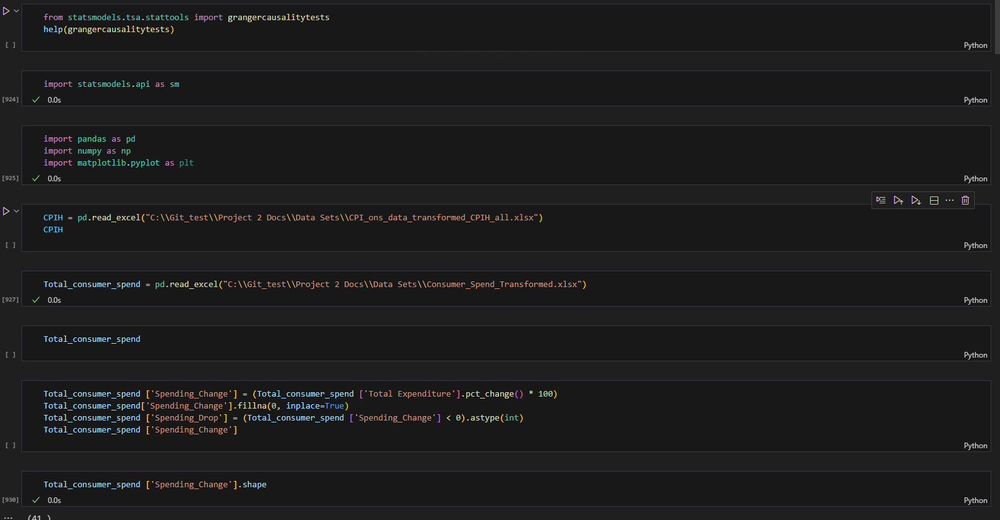
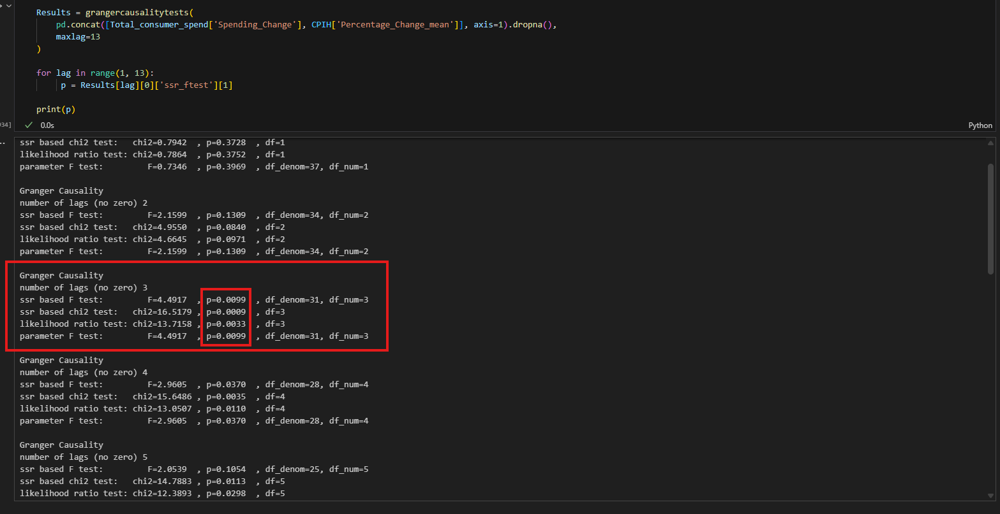
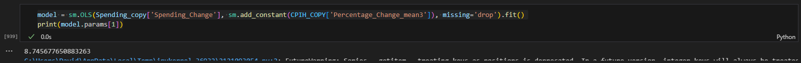

# Time-series Forecasting With Consuemr Spending ONS Data

Office For National Statistics is publicly accessed government economic data. The goal with this project is to be able to forecasting Consumer Spending across all sectors to identify where people are chosing to spend their money. This project can aid business's in deciding where they should focuse their marketing efforts and inventory allocation and adapt pricing stratgies based on sector specific spending strends.

By incorperating ETL-processed consumer spending data, inflation metrics and consumer confidence indicators, the project adjusts fro economic shifts like recessions. It employs three predictive models, with time-series and a manual lag and utilising cross validation with GrideSearch CV. The metrics used to select the model and parameters with best lag are R2 Train/Test Score and Negative MSE Cross-Validation against Negative MSE Test. The plan is to introduce more features that could influence the consumer spending outcomes for a more robust forecast.

#### ↓↓↓Links to Folders↓↓↓
[Data ETL🔎](Drook93/ONS-Govenment-Public-Spending-Forecast/ETL)
[EDA with Seaborn/Matplotlib](Drook93/ONS-Govenment-Public-Spending-Forecast/EDA)
[Hypothesis Tests](Drook93/ONS-Govenment-Public-Spending-Forecast/Hypothesis Test)
[Predictive Models](Drook93/ONS-Govenment-Public-Spending-Forecast/Predictive Models)

 

  ## Testing Inflation Lag Impact on Consumer Spending🧪

 *See link below to view the file ↓*
* [Hypothesis Test With Granger Causality/ Pearson Correlation](https://github.com/Drook93/ONS-Govenment-Public-Spending-Forecast/blob/main/Inflation_lag_correlation_test_and_granger_test.ipynb)

1. **Data Preparation**:
   - Load consumer spending and CPIH data.
   - Calculate percentage changes for spending and inflation.
   - 

2. **Correlation Analysis**:
   - Compute correlations between spending changes and lagged inflation.
   - Pearson Corrleation lag.
   - 

3. **Granger Causality Tests**:
   - Test if inflation Granger-causes spending changes (up to 13 lags).
   - Significant at lags 3, 4, 6-13 (p < 0.05).
   - 
     

4. **Lag-Specific Regression**:
   - Shift inflation mean by 3 and 4 lags.
   - Identify the direction of causation with OLS mode
   - Run OLS on spending vs. lagged inflation.
   - Coefficients: +8.75 (lag 3), (This identifies that when Inflation Accelerates over a quater that 3 quaters later Consumer Spending increases as a result).
   - 

5. **Export Results**:
   - Save CPIH with lags to Excel.
   - 

## Process Summary: Forecasting Consumer Spending with Lagged Inflation🔮

This notebook builds forecasting models for consumer spending using lagged inflation data, employing Lasso, Ridge, and RandomForest with GridSearchCV.
* [Model Selection and Predictive Analytics] - Machine Learning Lab](https://github.com/Drook93/IBM-Data-Science-Capstone-SpaceX/blob/main/SpaceX_Machine%20Learning%20Prediction_Part_5.ipynb)
* 
1. **Library Installation and Imports**:
   - Install statsmodels.
   - Import pandas, numpy, sklearn for modeling and evaluation.
   - ![Library Installation Image]

2. **Data Preparation**:
   - Load CPIH and consumer spending data.
   - Create lagged features (e.g., Inflation_Acceleration_lag3).
   - Train-test split.
   - 

3. **Model Definition and Hyperparameter Tuning**:
   - Define Lasso, Ridge, RandomForest models with parameters.
   - Use GridSearchCV with TimeSeriesSplit for tuning.
   - 

4. **Training and Prediction**:
   - Apply lagging and scaling.
   - Fit models, predict on test data.
   - 

5. **Evaluation and Results**:
   - Compute R2, MSE, RMSE.
   - Print best model, parameters, CV score.
   - Export results.
   - 

  
* [Final Presentation (Slide)]

